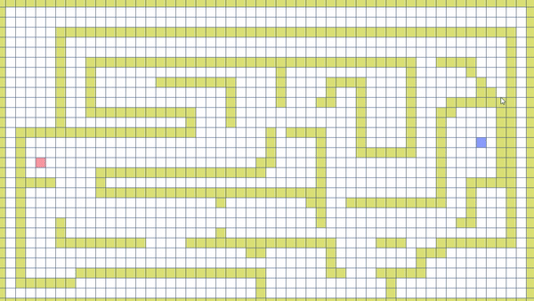
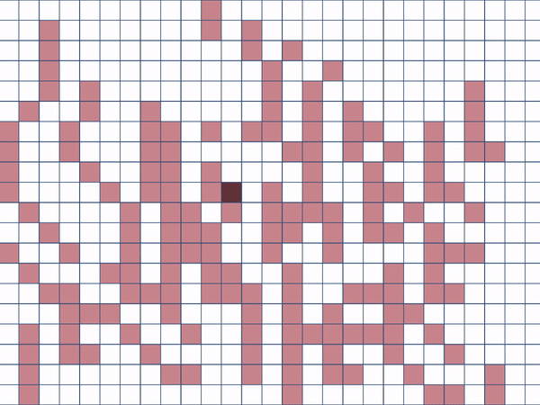

  
  

 

<h3 align="center">ASTAR SIMULATOR</h3>

---

 
      SIMPLE ASTAR SIMULATOR

## 📝 Table of Contents

- [Getting Started](#getting_started)
- [Acknowledgments](#acknowledgement)

## 🏁 Getting Started 

### Tutorial

1. **Execute Simulator**

    path: `YOUR_ASTAR_SIMULATOR_GIT_PATH/default/TestGame.exe`

1. **Manual**

    `Left Mouse Click`: Making or Removing the wall.
    
    `Left Mouse Drag`: Move Character.

    `Enter`: Find Path.
        
    `Backspace`: Clean up.

    

1. **Execute Simulator 2**

    path: `YOUR_ASTAR_SIMULATOR_GIT_PATH/move/Move.exe`

1. **Manual**

    `Left Mouse Drag`: Move Character.

    `Space bar`: Move with astar algorithm.

    

## 🎉 Acknowledgements 

- Title icon made by [Freepik](https://www.flaticon.com/kr/authors/freepik).

- If you have a problem. please make [issue](https://github.com/da-huin/cloud_requests/issues).

- Please help develop this project 😀

- Thanks for reading 😄
